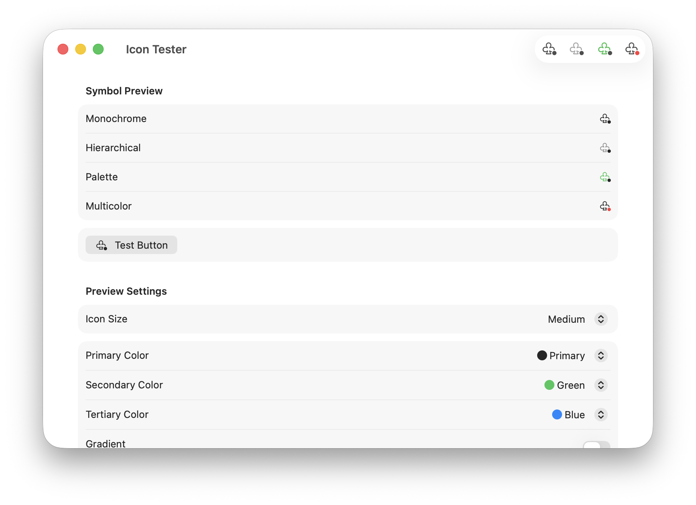

# Liquid Glass App Icon Tester

This is a simple template project to quickly test your Liquid Glass app icons and custom SF Symbols for Apple’s platforms.

## Requirements
Make sure you’ve installed Xcode 26 or newer!

## How to use it?
### App Icon
1. Replace the `AppIcon.icon` file with your own Icon Composer file.
   - Best done in the Finder! Use right click on the file in Xcode and select “Show in Finder” to replace it there.
2. Select the device you want to test in the titlebar (My Mac or iOS Simulator).
3. Press run (⌘K) aka play button.

> [!CAUTION]
> **After replacing the icon make sure to do a “Clean Build Folder” (⇧⌘K) (via the „Product" main menu) before running the build.** Xcode keeps the app icon cached quite heavily, so a clean build ensures the new icon is loaded correctly.

> [!TIP]
> If you want to use your own icon name, you also need to match the name in Xcode. To do that select the project file in the sidebar. Then on the right side go to: Targets → LiquidGlassIconTester → General → App Icons and Launch Screen → App Icon

### SF Symbol
1. Replace the `custom.symbol.svg` file with your own file in “Assets”.
   - Best done in the Finder! Use right click on the file in Xcode and select “Show in Finder” to replace it there.
2. Select the device you want to test in the titlebar (My Mac or iOS Simulator).
3. Press run (⌘K) aka play button.

> [!TIP]
> If you want to use your own symbol name, you also need to match the name in the `CustomSymbol.swift` file.

## Contribute
Feel free to suggest things as [issue](https://github.com/alexkaessner/LiquidGlassIconTester/issues) or create a PR request, if you want to help improving this template.